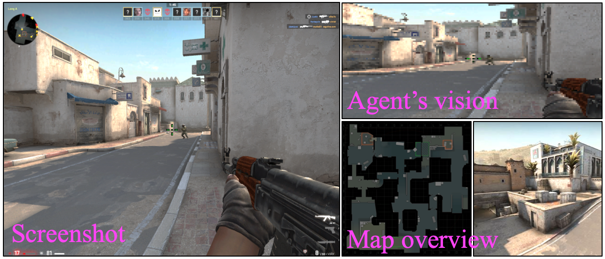

# Counter-Strike Deathmatch with Large-Scale Behavioural Cloning
ArXiv paper: Counter-Strike Deathmatch with Large-Scale Behavioural Cloning

Gameplay examples: https://youtu.be/p01vWk7uMvM

## What's included
We include a script to run the trained agent (TO APPEAR SOON!). We will list below the game settings we used when running the agent.

## What's not included
We do not currently share the parts of the code used to scrape the large-scale dataset, and are considering whether to release this in future. Reasons against: 1) it contains code that can be easily modified for cheating purposes 2) the paper is not yet published and we are continuing to develop it ourselves...

## License
This repo can be used for personal projects and open-source research. We do not grant a license for its commercial use in any form. If in doubt, please contact us for permission.

## Maintenance
This repo shares code used in research, used to provide some depth behind the paper. It's not production ready. It's unlikely to be robust across operating systems, python versions, python packages, future CSGO updates etc. I won't be actively maintaining this repo for these purposes, nor responding to minor bugs.

