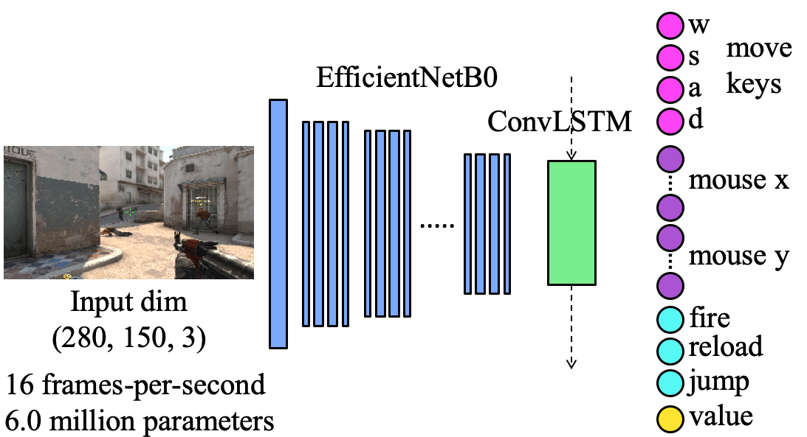

# Counter-Strike Deathmatch with Large-Scale Behavioural Cloning
[Tim Pearce](https://twitter.com/Tea_Pearce), [Jun Zhu](https://ml.cs.tsinghua.edu.cn/~jun/index.shtml)  
IEEE Conference on Games (CoG) 2022 [⭐️ Best Paper Award!]. Also presented at Offline RL workshop, NeurIPS 2021  
Paper: https://arxiv.org/abs/2104.04258  
Four minute introduction video: https://youtu.be/rnz3lmfSHv0  
Gameplay examples: https://youtu.be/KTY7UhjIMm4  





[comment]: <> (Previous version of agent: https://youtu.be/p01vWk7uMvM)

## Contents

1. [Code Overview](#code-overview)
2. [Trained Models](#trained-models)
3. [Datasets](#datasets)
4. [Requirements](#requirements)
5. [License](#license)
6. [Disclaimer](#disclaimer)
7. [Maintenance](#maintenance)
8. [Troubleshooting](#troubleshooting)


## Code Overview

We briefly describe the workflow: dataset capture -> data processing -> training -> testing. 
1) Use ```dm_record_data.py``` to scrape data as a spectator, or ```dm_record_data_me_wasd.py``` to record when actively playing. This creates .npy files with screenshots and metadata. 
2) Run ```dm_infer_actions.py``` on .npy files from step 1 to infer actions from the metadata ('inverse dynamics model'). These are appended to the same .npy files. The visulations and stats produced by this script can be used to clean the data -- e.g. if the metadata from GSI and RAM disagrees for some variables, this is a sign that the data might be unreliable, if there are long periods of immobility (```vel_static```), this can mean you were tracking a motionless player. We suggest deleting such files.
3) Run ```dm_pretrain_process.py``` on .npy files from step 2, this creates new .hdf5 files containing screenshots and onehot targets. 
4) (Optional.) Run ```tools_extract_metaadata.py``` to pull out metadata from the .npy files, saves as new .npy file.
5) Run ```dm_train_model.py``` to train a model.
6) Use ```tools_create_stateful.py``` to create a 'stateful' version of the model.
7) Script ```dm_run_agent.py``` runs the model in the CSGO environment.


Brief overview of each script's purpose.


- ```config.py```
    : Contains key global hyperparameters and settings. Also several functions used across many scripts.
- ```screen_input.py```
    : Gets screenshot of the CSGO window, does some cropping and downsampling. Uses win32gui, win32ui, win32con, OpenCV.
- ```key_output.py```
    : Contains functions to send mouse clicks, set mouse position and key presses. Uses ctypes.
- ```key_output.py```
    : Contains functions to check for mouse location, mouse clicks and key presses. Uses win32api and ctypes.
- ```meta_utils.py```
    : Contains functions to set up RAM reading. Also contains a server class to connect to CSGO's GSI tool -- you should update ```MYTOKENHERE``` variable if setting up GSI.
- ```dm_hazedumper_offsets.py```
    : Contains offsets to read variables from RAM directly. They updated by the function in ```meta_utils.py```.
- ```dm_record_data.py```
    : Records screenshots and metadata when in spectator mode. (Note these record scripts can be temperamental, and depend on hazedumper offsets being up to date.)
- ```dm_record_data_me_wasd.py```
    : Records screenshots and metadata when actively playing on local machine.
- ```dm_infer_actions.py```
    : For recorded dataset, infer actions from metadata and append to same file. Also stats indicative of data quality, and some functionality to rename files sequentially.
- ```dm_pretrain_process.py```
    : Takes .npy files from ```dm_infer_actions.py```, and creates twin .hdf5 files ready for fast data loading with inputs and labels as expected by model. Also a function to strip image from .npy files.
- ```dm_train_model.py```
    : Trains the neural network model. Either from scratch or from a previous checkpoint.
- ```dm_run_agent.py```
    : Runs a trained model in CSGO. Option to collect metadata (eg score) using ```IS_GSI=True```.
- ```tools_dataset_inspect.py```
    : Minimal code to open different datasets and accompanying metadata files.
- ```tools_extract_metadata.py```
    : Cuts out metadata (currvars, infer_a and helper_arr) from the original .npy files, and saves as new .npy without image. Aggregates 100 files together.
- ```tools_dataset_stats.py```
    : Collates metadata from the large online dataset, and produces summary stats and figures as in appendix A.
- ```tools_create_stateful.py```
    : This takes a trained 'non-stateful' model and saves a cloned 'stateful' version that should be used at test time (otherwise LSTM states reset between each forward pass). Required due to keras weirdness.
- ```tools_map_coverage_analysis.py```
    : Visualises map coverage of different agent and datasets, computes Earth mover's distance.
- ```tools_view_save_egs.py```
    : Opens and displays sequences of images .hdf5 and metadata .npy. Option of overlaying inferred actions. Option of saving as .png.
- ```console_csgo_setup.txt```
    : Console commands for setting up CSGO levels.


## Trained Models

Four trained models are provided. There are 'non-stateful' (use during training) and 'stateful' (use at test time) versions of each.  
Models can be downloaded at (under ```/trained_models``` folder): https://1drv.ms/u/s!AjG1JlThUkPgh1JEIxETxvaphzgC?e=2AJfA3 .

- ```ak47_sub_55k_drop_d4```
    : Pretrained on AK47 sequences only.
- ```ak47_sub_55k_drop_d4_dmexpert_28```
    : Finetuned on expert deathmatch data.
- ```ak47_sub_55k_drop_d4_aimexpertv2_60```
    : Finetuned on aim mode expert data.
- ```July_remoterun7_g9_4k_n32_recipe_ton96__e14```
    : Pretrained on full dataset.


## Datasets

All datasets are available at: https://1drv.ms/u/s!AjG1JlThUkPgh1JEIxETxvaphzgC?e=2AJfA3 . (Please email ```tim dot pearce at microsoft dot com``` with any issues.) A brief description of dataset and directory structure is given below. 

- ```dataset_dm_scraped_dust2/hdf5_dm_july2021_*.hdf5```
    - total files: 5500
    - approx size: 700 GB
    - map: dust2
    - gamemode: deathmatch
    - source: scraped from online servers

- ```dataset_dm_expert_dust2/hdf5_dm_july2021_expert_*.hdf5```
    - total files: 190
    - approx size: 24 GB
    - map: dust2
    - gamemode: deathmatch
    - source: manually created, clean actions

- ```dataset_aim_expert/hdf5_aim_july2021_expert_*.hdf5```
    - total files: 45
    - approx size: 6 GB
    - map: aim map
    - gamemode: aim mode
    - source: manually created, clean actions

- ```dataset_dm_expert_othermaps/hdf5_dm_nuke_expert_*.hdf5```
    - total files: 10
    - approx size: 1 GB
    - map: nuke
    - gamemode: deathmatch
    - source: manually created, clean actions

- ```dataset_dm_expert_othermaps/hdf5_dm_nuke_expert_*.hdf5```
    - total files: 10
    - approx size: 1 GB
    - map: nuke
    - gamemode: deathmatch
    - source: manually created, clean actions

- ```dataset_dm_expert_othermaps/hdf5_dm_inferno_expert_*.hdf5```
    - total files: 10
    - approx size: 1 GB
    - map: mirage
    - gamemode: deathmatch
    - source: manually created, clean actions

- ```dataset_metadata/currvarsv2_dm_july2021_*_to_*.npy, currvarsv2_dm_july2021_expert_*_to_*.npy, currvarsv2_dm_mirage_expert_1_to_100.npy, currvarsv2_dm_inferno_expert_1_to_100.npy, currvarsv2_dm_nuke_expert_1_to_100.npy, currvarsv2_aim_july2021_expert_1_to_100.npy```
    - total files: 55 + 2 + 1 + 1 + 1 + 1 = 61
    - approx size: 6 GB
    - map: as per filename
    - gamemode: as per filename
    - source: as per filename

- ```location_trackings_backup/```
    - total files: 305
    - approx size: 0.5 GB
    - map: dust2
    - gamemode: deathmatch
    - source: contains metadata used to compute map coverage analysis
        - **currvarsv2_agentj22** is the agent trained over the full online dataset
        - **currvarsv2_agentj22_dmexpert20** is previous model finetuned on the clean expert dust2 dataset
        - **currvarsv2_bot_capture** is medium difficulty built-in bot


### Structure of .hdf5 files (image and action labels): 

Each file contains an ordered sequence of 1000 frames (~1 minute) of play. 
This contains screenshots, as well as processed action labels.
We chose .hdf5 format for fast dataloading, since a subset of frames can be accessed without opening the full file.
The lookup keys are as follows (where i is frame number 0-999)
- **frame_i_x**: is the image 
- **frame_i_xaux**: contains actions applied in previous timesteps, as well as health, ammo, and team. see dm_pretrain_preprocess.py for details, note this was not used in our final version of the agent
- **frame_i_y**: contains target actions in flattened vector form; [keys_pressed_onehot, Lclicks_onehot, Rclicks_onehot, mouse_x_onehot, mouse_y_onehot]
- **frame_i_helperarr**: in format [kill_flag, death_flag], each a binary variable, e.g. [1,0] means the player scored a kill and did not die in that timestep

### Structure of .npy files (scraped metadata): 

Each .npy file contains metadata corresponding to 100 .hdf5 files (as indicated by file name)
They are dictionaries with keys of format: file_numi_frame_j for file number i, and frame number j in 0-999
The values are of format **[curr_vars, infer_a, frame_i_helperarr]** where, 
- **curr_vars**: contains a dictionary of the metadata originally scraped -- see dm_record_data.py for details
- **infer_a**: are inferred actions, [keys_pressed,mouse_x,mouse_y,press_mouse_l,press_mouse_r], with mouse_x and y being continuous values and keys_pressed is in string format
- **frame_i_helperarr**: is a repeat of the .hdf5 file


## Requirements

### Python and OS requirements
Below are the Python package versions used in development. The OS used for interacting with the game (testing and recording) was Windows, and for model training was Linux. 
```
Python: '3.6.9' 
tensorflow: '2.3.0'
tensorflow.keras: '2.4.0'
h5py: '2.10.0'
numpy: '1.18.5'
OpenCV (cv2): '4.4.0'
scipy: '1.4.1'
ctypes: '1.1.0'
json: '2.0.9'
```

### Hardware

Running the agent requires making forward passes through a large convolutional neural networks at 16 fps. If you do not have a CUDA enabled GPU, the agent's performance may degrade.


### CSGO requirements
We collected the datasets and conducted testing over game versions 1.37.7.0 to 1.38.0.1. CSGO is continually updated and this may affect performance. The map dust2 received minor updates in 1.38.0.2. To test on the map from version 1.38.0.1, download here: https://steamcommunity.com/sharedfiles/filedetails/?id=2606435621. Future updates to gameplay may also degrade performance, consider rolling back the CSGO game version in this case. 

Game State Integration (GSI) is used to pull out some metadata about the game. The ```dm_run_agent.py``` script is written so that it may be run without installing GSI (option ```IS_GSI```). If you'd like to record data or extract metadata while running the agent, you'll need to set up GSI: https://www.reddit.com/r/GlobalOffensive/comments/cjhcpy/game_state_integration_a_very_large_and_indepth/ and update ```MYTOKENHERE``` in ```meta_utils.py```.

Game settings (resolution, cross hair, mouse sensitivity etc) are documented in the paper, appendix E.


## License
This repo can be used for personal projects and open-sourced research. We do not grant a license for its commercial use in any form. If in doubt, please contact us for permission.

## Disclaimer
Whilst our code is not intended for cheating/hacking purposes, it's possible that Valve may detect the usage of some of these scripts in game (for example simulated mouse movements and RAM parsing) which in turn might lead to suspicion of cheating. We accept no liability for these sort of issues. Use it at your own risk! 

## Maintenance
This repo shares code used for _academic research_. It's not production ready. It's unlikely to be robust across operating systems, python versions, python packages, future CSGO updates etc. There's no plan to actively maintain this repo for these purposes, nor to fix minor bugs. If you'd like to help out with this, please reach out.


## Troubleshooting
A few tips that might help get the agent working on your local system (with thanks to  Mert Can Çakmak https://github.com/Mccakmak).
- Ensure you've matched the game settings used. Particularly important are resolution and mouse settings:

    - Game resolution: Normal 4:3, 1024×768, windowed
    - Mouse sensitivity: 2.50
    - Mouse raw input: Off
    - Reverse mouse: Off
    - Mouse acceleration: Off
    - Crosshair settings: Classic static, green – RGB: (46, 250, 42), length 4.3, thickness 1.8, gap 2.0, no outline, no centre dot. (Length 2.8 also used in some training data and demos.)
    - (Or use crosshair code: CSGO-UKcZG-QN8eW-WQMvd-NX6xr-RPqRP)
    - All graphics options: Lowest quality setting
    - Boost Player Contrast: Enabled
    - Multisampling AA Mode: 2x MSAA
    - HUD edge positions: as large as possible
    - HUD scale: 0.56
    - HUD color: Default
    - Radar HUD size: 0.80
    - Clear decals is bound to ‘n’ key (https://www.skinwallet.com/csgo/clear-decals-csgo/)

- You may also want to match the view model settings used in the paper (probably less important):

    - cl_righthand 1
    - viewmodel_offset_x 1
    - viewmodel_offset_y 1
    - viewmodel_offset_z  -1
    - viewmodel_fov 60
    - cl_bobamt_lat 0.33
    - cl_bobamt_vert 0.14
    - cl_bobcycle 0.98
    - cl_viewmodel_shift_left_amt 1.5
    - cl_viewmodel_shift_right_amt 0.75

- Ensure the code can find your game window -- e.g. as of Feb 2022 the window was renamed, so you should use
```hwin_csgo = win32gui.FindWindow(None,'Counter-Strike: Global Offensive - Direct3D 9')```
- Run ```screen_input.py```  directly to test whether screenshots are being captured correctly
- Hardcode some actions in ```dm_run_agent.py``` to see if they have desired effect, e.g. set ```mouse_x_smooth``` to a small constant, does the agent spin? Try similar for ```Lclicks``` and ```keys_pressed```
- One user reported having to include at top of ```dm_run_agent.py```:
```
import win32com.client
shell = win32com.client.Dispatch("WScript.Shell")
shell.SendKeys('%')
```
- Setting ```IS_DEMO=True``` in ```dm_run_agent.py``` should display the input received by the agent and action selection visualisations, which might highlight issues
- Is the agent processing the actions quickly enough? -- uncomment ```print('arrived later than wanted to :/, took ',round(time.time() - loop_start_time,4))``` in ```config.py``` to display warnings. Is the GPU being used by the neural net?
- Restrict CSGO's frame rate to free up some resources, e.g. run the CSGO console command ```fps_max 64;```.
- The mouse will appear quite stilted when you watch in real time -- actions are only applied 16 (or 32 if ```IS_SPLIT_MOUSE=True``` ) times per second
- It's been reported more recent combinations of Python (v3.9) and tensorflow (v2.4.5) lead to different predictions by the neural network (suspected due to differences in the way the model is loaded). It should work mormally with Python v3.6.8 or v3.6.9 and tensorflow v2.3.0.

